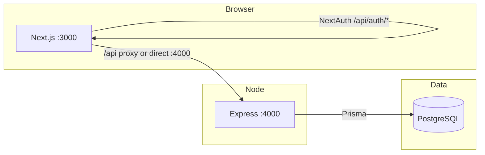

# ANTIVAXXER — Developer Guide

**Setup:** **[ONBOARDING.md](./ONBOARDING.md)** · **Index / scripts:** **[README.md](./README.md#documentation-index-5-files)**

Sections **A–H** = product overview, architecture, features, **manual QA flows**, curl checks, env table, key files. Sections **1+** = env loading, migrations, servers, admin, cart, API layout, file reference. **Postgres / root `.env` first-time steps:** only **[ONBOARDING.md](./ONBOARDING.md)**.

---

## A. What this project is

**ANTIVAXXER** — streetwear ecommerce: **Next.js 15** storefront, **Express** API, **PostgreSQL** + **Prisma**. Catalog, client-side cart, Stripe checkout, NextAuth, admin, search, newsletter, promos, wishlist, abandoned-cart recovery (when configured).

## B. Architecture



- **`NEXT_PUBLIC_API_URL`:** browser calls Express directly (CORS). **Relative `/api` on :3000:** Next **fallback** rewrites forward to Express except real Next routes (e.g. **`/api/auth/*`**). NextAuth **server** calls **`POST /api/auth/login`** on Express for credentials.

## C. Feature inventory

| Area | Notes |
|------|--------|
| **Catalog** | `GET /api/products`, `/categories`, `/search` |
| **Product UI** | Modal + `/shop/[slug]` — **Add to Cart**; pay only at checkout |
| **Cart** | Context + **localStorage**; drawer → **Checkout** |
| **Checkout** | **`POST /api/checkout/create-payment-intent`** (server prices), Stripe Elements |
| **Auth** | `POST /api/auth/register`; NextAuth → Express login |
| **Admin** | `/admin` + **`/api/admin/*`** (Bearer JWT admin role or legacy **`ADMIN_TOKEN`**) |
| **Health** | `GET /api/health` |

## D. Manual test flows

With **`npm run dev`**, migrated DB, seeded data, root `.env` (Stripe optional for payment UI):

1. **Shop:** http://localhost:3000 — products load from API/DB.  
2. **Add to cart:** Quick view or PDP — toast + drawer (**no** API for cart payload).  
3. **Checkout:** `/checkout` — needs Stripe test keys for payment step.  
4. **Login:** `/account/login` — **`/api/auth/session`** on **:3000** should return **200**.  
5. **Admin:** user with **`admin`** role **or** `sessionStorage.setItem('av_admin_token', '<ADMIN_TOKEN from .env>')` then `/admin`.

## E. Quick `curl` checks

```bash
curl -s http://localhost:4000/api/health | jq .
curl -s "http://localhost:4000/api/products?limit=5" | jq '.products | length'
curl -s -o /dev/null -w "%{http_code}\n" http://localhost:3000/api/auth/session
```

## F. Env vs behavior

| Missing | Effect |
|---------|--------|
| `DATABASE_URL` | Health fails / empty catalog |
| `NEXTAUTH_SECRET` | Broken sessions |
| `STRIPE_*` | Checkout payment broken; browsing OK |

## G. Key paths

`frontend/next.config.js`, `frontend/src/lib/productVariantUtils.js`, `CartContext.js`, `checkout/page.js`, `app/api/auth/[...nextauth]/route.js`, `api/src/index.js`, `api/prisma/schema.prisma`.

## H. Action → stack

| User | UI | Stack |
|------|-----|-------|
| Open shop | Grid | API → Prisma |
| Add to cart | Drawer | localStorage |
| Pay | Stripe | API + Stripe |
| Log in | Account | NextAuth + API |
| Admin | CRUD | Bearer + API |

---

## 1. Environment & database (reference)

**First-time setup** (Postgres install, root `.env`, `DATABASE_URL`, secrets, `npm run db:bootstrap`, `npm run dev`, verification) is fully documented in **[ONBOARDING.md](./ONBOARDING.md)** — follow that once per machine; this section only adds **technical details** you need while developing.

### 1.1 How `api/loadEnv.js` works

These entry points all call `loadEnv` (directly or via `prisma-env.js`):

`api/src/index.js`, `api/prisma/seed.js`, `api/scripts/run-migrations.js`, and Prisma CLI via **`api/scripts/prisma-env.js`**.

**Load order:** **`api/.env`** (if present), then **repository root `.env`** with **`override: true`** → **root wins** on duplicate keys. Use **`api/.env`** only for local overrides; do not drop a stale `.env.example` copy there with a fake `DATABASE_URL`.

Use **`cd api && npm run db:migrate:dev`** (not raw `npx prisma migrate dev` in a bare shell) so `DATABASE_URL` is loaded the same way as the running API.

### 1.2 Frontend env (optional)

Next.js also reads **`frontend/.env.local`**. For local dev, root `.env` plus `.env.example` defaults for **`NEXT_PUBLIC_API_URL`** are usually enough.

---

## 2. Migrations, seed, and Prisma Studio

After root **`.env`** is valid (**[ONBOARDING.md](./ONBOARDING.md)**): **`npm run db:bootstrap`** from the repo root runs **`db:ready`**, **`db:migrate:dev`**, and **`db:seed`**. From **`api/`** you can run **`npm run db:migrate:dev`**, **`npm run db:seed`**, or **`npm run db:studio`** (GUI at http://localhost:5555).

### If something goes wrong with the database

```bash
# Reset everything — drops all tables, re-applies migrations (non-interactive)
cd api
node scripts/prisma-env.js migrate reset --force

# Then seed again if you need demo data
npm run db:seed

# Destructive — only for local development.
```

### If You Change the Schema

```bash
cd api

# 1. Edit prisma/schema.prisma
# 2. Generate a new migration (loads root `.env` like other db scripts)
npm run db:migrate:dev -- --name describe_what_changed

# Prisma client is regenerated by migrate dev; if needed: npm run db:generate
```

Never edit migration files after they've been created. If a migration is wrong, create a new one that fixes it.

---

## 3. How the Two Servers Connect

The project runs two processes:

```
Browser → Next.js :3000  (pages + NextAuth at /api/auth/*)
Browser → Express :4000  (/api/* JSON + Prisma → PostgreSQL)
```

**Next.js** serves UI and **NextAuth** route handlers under **`app/api/auth/`** on port **3000**.

**Express** serves catalog, checkout, admin, registration, etc. under **`/api/*`** on port **4000**.

**Two ways the browser hits Express**

1. **Direct:** `NEXT_PUBLIC_API_URL` (e.g. `http://localhost:4000/api`) — most data `fetch` calls use this. Express **`cors`** allows the Next origin (`NEXTAUTH_URL` / default `http://localhost:3000`).

2. **Relative `/api` on port 3000:** Some code uses **`/api/...`** as the base. In **`frontend/next.config.js`**, rewrites use **`fallback`**: Next tries filesystem and **App Router API routes first**, then forwards **unmatched** `/api/*` to Express. That way **`/api/auth/session`** stays on Next (NextAuth) instead of 404ing on Express.

Rough shape of the config:

```javascript
async rewrites() {
  const destinationBase =
    process.env.NEXT_PUBLIC_API_URL || 'http://localhost:4000/api';
  return {
    fallback: [
      { source: '/api/:path*', destination: `${destinationBase}/:path*` },
    ],
  };
}
```

In production, set `NEXT_PUBLIC_API_URL` to your deployed API origin.

---

## 4. How the Admin System Works

### Accessing `/admin`

The hook **`useAdminAuth`** (`frontend/src/lib/adminAuth.js`) decides whether you can load admin pages and builds **`Authorization: Bearer ...`** for **`/api/admin/*`** requests.

**Path A — NextAuth user with `admin` role (preferred)**  
Log in at **`/account/login`** with a user whose **`role`** is **`admin`** in PostgreSQL. The session includes **`apiToken`** (JWT from **`POST /api/auth/login`**). Admin fetches send **`Authorization: Bearer <apiToken>`**; **`api/src/middleware/adminAuth.js`** verifies the JWT and checks the role.

**Path B — Legacy `ADMIN_TOKEN` (local / ops)**  
The API still accepts **`Authorization: Bearer <ADMIN_TOKEN>`** when it matches the **`ADMIN_TOKEN`** env var. The frontend does **not** show a dedicated “enter admin password” screen for this. For local testing, open DevTools on **`http://localhost:3000`**, run:

```javascript
sessionStorage.setItem('av_admin_token', 'PASTE_ADMIN_TOKEN_FROM_ROOT_ENV_FILE');
```

Reload **`/admin`**. **`useAdminAuth`** will send that value as **Bearer**. Clear the tab/sessionStorage when done.

**If access is denied** you may see **“Admin access denied.”** or be redirected to **`/account`** or **`/account/login`**.

### Viewing Products

The admin product list shows all products (including drafts and archived) with:
- Total stock across all variants
- Stock health indicators (green = OK, yellow = low stock, red = out of stock)
- Status badges (active, draft, archived)

Filter by status or check "Low stock only" to find products needing restocking.

### Editing a Product

Click any row in the product list to open the editor. You can change:
- Name, slug, category, prices, description, badge, status
- Which colors and sizes are available (toggle buttons)
- Stock quantity per variant (inline in the variant matrix table)
- Price overrides per variant (leave blank to use base price)
- Active/inactive toggle per variant

Click **Save** to update. The editor sends to the API which validates with Zod and updates the database.

### Creating a New Product

Click **+ Add Product** in the admin list. Fill in the form. The slug auto-generates from the name. Select colors and sizes. After saving, the editor redirects to the edit page where you can manage variants.

Note: Variants are auto-generated by the seed script based on color × size combinations. For new products created via admin, you'll need to create variants via the API or Prisma Studio until the variant auto-generation is added to the editor.

---

## 5. How the Cart Works

Cart state lives in React Context (`CartContext.js`) and persists to `localStorage` under the key `antivaxxer_cart`.

### Flow

1. User clicks a product card → ProductModal opens
2. User selects size and color → component finds matching variant
3. User clicks "Add to Cart" → `addItem()` adds to context state
4. Context saves to localStorage on every change
5. Toast notification confirms the add
6. Cart drawer opens showing the item

### Cart Data Shape

Each cart item looks like:
```javascript
{
  variantId: "uuid-of-the-variant",
  productId: "uuid-of-the-product",
  name: "Classic Logo Tee — Black",
  color: "Black",
  size: "L",
  price: 35.00,
  image: null,  // Will be a URL once product images are uploaded
  sku: "AV-TEE-BLK-L-1",
  qty: 1
}
```

### Limits

- Maximum 99 of any single variant (enforced in `addItem` and `updateQty`)
- Minimum quantity is 1 (use the remove button to delete, not decrement to 0)
- Cart survives page refresh (localStorage) but clears when browser data is cleared

### Checkout

The cart drawer **Checkout** link goes to **`/checkout`**. The checkout page posts line items (variant IDs + qty) to **`POST /api/checkout/create-payment-intent`**; the server loads prices from the DB and returns a Stripe `clientSecret`.

---

## 6. How to Swap the Logo

The storefront ships **SVG wordmarks** in **`frontend/public/images/`**:

- **`logo.svg`** — hero (`HeroSection.js`)  
- **`logo-nav.svg`** — header (`Header.js`)

Each component uses an **``** with an **`onError`** fallback to styled **“ANTIVAXXER”** text if the file is missing.

To use your own artwork:

1. Replace those files (keep the same names), **or** add new assets and update the `src` paths in **`Header.js`**, **`HeroSection.js`**, and **`frontend/src/components/seo/JsonLd.js`** (structured data `logo` URL).
2. For **`next/image`**, add local patterns or use `` as today.

---

## 7. How to Add the US Map

The Resources page embeds an interactive map via iframe from `frontend/public/us-map.html`. A placeholder file is included.

To add your real map:

1. Take one of the map files from the earlier build session:
   - `us-map-edgy-final-v2.html` (Edgy Badass theme — matches brand)
   - `us-map-smart-final-v2.html` (Smart Casual theme)
   - `us-map-treasure-final-v2.html` (Treasure Map theme)

2. Rename it to `us-map.html`

3. Replace `frontend/public/us-map.html` with it

4. Refresh the Resources page — the real map loads immediately

No code changes needed. The iframe source stays the same.

---

## 8. How the API is Organized

### Public Endpoints (no auth)

| Method | Path | What It Does |
|--------|------|-------------|
| GET | /api/health | Server health check |
| GET | /api/products | List products (filterable, sortable, paginated) |
| GET | /api/products/:slug | Single product with full variant matrix |
| GET | /api/categories | List categories with product counts |

### Admin Endpoints (require Bearer token)

| Method | Path | What It Does |
|--------|------|-------------|
| GET | /api/admin/products | All products with stock data |
| GET | /api/admin/products/:id | Single product for editor form |
| POST | /api/admin/products | Create new product |
| PUT | /api/admin/products/:id | Update product |
| PUT | /api/admin/products/:id/variants | Bulk update variants |
| GET | /api/admin/options | All colors, sizes, categories for dropdowns |

### How auth works on admin endpoints

`api/src/middleware/adminAuth.js` accepts **Bearer** tokens: **JWT** (login user with `admin` role), **`CRON_TOKEN`**, or legacy **`ADMIN_TOKEN`** match. See **§4** above for how the frontend sends the token.

### How Validation Works

Every endpoint that accepts input uses Zod schemas defined in `api/src/validators/`. The `validate` middleware in `api/src/middleware/validate.js` runs the schema against `req.query`, `req.params`, or `req.body` before the route handler executes.

If validation fails, the client gets a 400 response with specific field-level errors:
```json
{
  "error": {
    "code": "VALIDATION_ERROR",
    "message": "Invalid request parameters.",
    "details": [
      { "field": "slug", "message": "Slug must be lowercase letters, numbers, and hyphens" }
    ]
  }
}
```

The route handler never runs with bad data.

---

## 9. How to Add a New API Endpoint

Example: adding a search endpoint.

### Step 1: Create the Zod validator (if the endpoint accepts input)

```javascript
// api/src/validators/search.js
const { z } = require('zod');

const searchQuery = z.object({
  q: z.string().min(1).max(200),
  limit: z.coerce.number().int().min(1).max(50).optional().default(10),
});

module.exports = { searchQuery };
```

### Step 2: Create the route file

```javascript
// api/src/routes/search.js
const express = require('express');
const router = express.Router();
const { prisma } = require('../lib/prisma');
const { validate } = require('../middleware/validate');
const { searchQuery } = require('../validators/search');

router.get('/', validate(searchQuery, 'query'), async (req, res, next) => {
  try {
    const { q, limit } = req.query;
    // Your query logic here
    const results = await prisma.product.findMany({
      where: { name: { contains: q, mode: 'insensitive' } },
      take: limit,
    });
    res.json({ results });
  } catch (error) {
    next(error);
  }
});

module.exports = router;
```

### Step 3: Wire it into the server

```javascript
// api/src/index.js — add this line with the other routes
app.use('/api/search', require('./routes/search'));
```

### Step 4: Test it

```bash
curl http://localhost:4000/api/search?q=tee
curl http://localhost:4000/api/search?q=&limit=5  # should fail validation
```

---

## 10. How to Add a New Frontend Page

Example: adding a Contact page.

### Step 1: Create the page file

```javascript
// frontend/src/app/contact/page.js
export const metadata = {
  title: 'Contact',
  description: 'Get in touch with ANTIVAXXER.',
};

export default function ContactPage() {
  return (
    <div className="min-h-screen">
      <div className="max-w-3xl mx-auto px-4 py-24 text-center">
        <h1 className="font-heading text-5xl tracking-widest text-av-bone mb-6">
          CONTACT
        </h1>
        {/* Your content here */}
      </div>
    </div>
  );
}
```

That's it. Next.js automatically creates the route `/contact` from the folder name. No router configuration needed.

### Step 2: Add it to navigation (optional)

In `frontend/src/components/layout/Header.js`, add to the `navLinks` array:
```javascript
const navLinks = [
  { href: '/', label: 'Shop' },
  { href: '/about', label: 'About' },
  { href: '/faq', label: 'FAQ' },
  { href: '/resources', label: 'Resources' },
  { href: '/contact', label: 'Contact' },  // new
];
```

Same in `Footer.js` if you want it there.

---

## 11. Understanding the Product Data Model

```
Category (tees, hoodie, collab, etc.)
  └── Product (Classic Logo Tee)
        ├── has many Colors (Black, Pepper, Blue Jean)
        ├── has many Sizes (S, M, L, XL, 2XL, 3XL)
        ├── has many Variants (one per color × size combo)
        │     └── Variant = the actual purchasable SKU
        │           ├── SKU: AV-TEE-BLK-L
        │           ├── stock_qty: 50
        │           ├── price_override: null (uses product base_price)
        │           └── weight_oz: 10.0
        └── has many Images (per product, optionally per color)
```

**Why variants exist separately from products:**
A "Classic Logo Tee" is one product. But "Classic Logo Tee in Black, size Large" is a specific thing someone buys. That's a variant. It has its own SKU, its own stock count, and can have its own price. When someone adds to cart, they add a variant — not a product.

**The junction tables:**
`product_colors` and `product_sizes` define which colors and sizes a product OFFERS. `variants` defines the actual purchasable combinations. A product might offer Black and Pepper in S through 3XL, creating 12 variants (2 colors × 6 sizes).

---

## 12. File-by-File Reference

### API Files

| File | Purpose |
|------|---------|
| `api/src/index.js` | Express server entry point, middleware setup, route wiring |
| `api/src/lib/prisma.js` | Prisma client singleton (prevents connection pool exhaustion) |
| `api/src/middleware/adminAuth.js` | Admin auth: JWT (user role), `CRON_TOKEN`, legacy `ADMIN_TOKEN` |
| `api/src/middleware/errorHandler.js` | Global error handler — structured responses, no internals exposed |
| `api/src/middleware/rateLimiter.js` | 5 rate limit tiers (login, register, checkout, admin, general) |
| `api/src/middleware/validate.js` | Zod validation middleware — reusable for query, params, body |
| `api/src/routes/products.js` | Public product catalog endpoints |
| `api/src/routes/categories.js` | Public category list endpoint |
| `api/src/routes/admin.js` | Admin CRUD endpoints (list, get, create, update, variants, options) |
| `api/src/validators/products.js` | Zod schemas for public product endpoints |
| `api/src/validators/admin.js` | Zod schemas for admin product CRUD |
| `api/prisma/schema.prisma` | Database schema (Prisma) — products, orders, users, etc. |
| `api/prisma/seed.js` | Seeds 16 products with 114 variants |
| `api/prisma/migrations/` | SQL migration files (auto-generated by Prisma) |

### Frontend Files

| File | Purpose |
|------|---------|
| `frontend/src/app/layout.js` | Root layout — Header, Footer, CartProvider, ToastProvider |
| `frontend/src/app/page.js` | Home page — hero section + product grid |
| `frontend/src/app/shop/page.js` | Shop page — product grid with filters |
| `frontend/src/app/about/page.js` | About page — brand story |
| `frontend/src/app/faq/page.js` | FAQ page — 9 questions with accordion |
| `frontend/src/app/resources/page.js` | Resources page — national orgs + US Map embed |
| `frontend/src/app/admin/layout.js` | Admin layout — separate header with "Admin" badge |
| `frontend/src/app/admin/page.js` | Admin product list — table with stock data |
| `frontend/src/app/admin/products/[id]/page.js` | Admin product editor — form with variant matrix |
| `frontend/src/components/layout/Header.js` | Sticky nav, mobile menu, cart icon |
| `frontend/src/components/layout/Footer.js` | 3-column footer with social links |
| `frontend/src/components/product/ProductGrid.js` | Fetches products from API, renders cards |
| `frontend/src/components/product/ProductCard.js` | Individual product tile |
| `frontend/src/components/product/CategoryFilter.js` | Category filter tab bar |
| `frontend/src/components/product/ProductModal.js` | Product detail modal with size/color selectors |
| `frontend/src/components/cart/CartContext.js` | Cart state management + localStorage persistence |
| `frontend/src/components/cart/CartDrawer.js` | Slide-out cart panel |
| `frontend/src/components/ui/Toast.js` | Notification system (success, error, warning) |
| `frontend/src/components/ui/Skeleton.js` | Loading placeholder components |
| `frontend/src/lib/productVariantUtils.js` | Shared variant + color-filtered image helpers (modal + PDP) |
| `frontend/src/styles/globals.css` | Tailwind entry, base styles, animations |

### Config Files

| File | Purpose |
|------|---------|
| `package.json` (root) | Monorepo workspace config, shared scripts |
| `frontend/package.json` | Next.js + Tailwind dependencies |
| `api/package.json` | Express + Prisma + Zod + bcrypt dependencies |
| `shared/package.json` | Shared workspace config |
| `shared/constants/index.js` | Categories, sizes, statuses shared between frontend and API |
| `.env.example` | All environment variables with phase documentation |
| `.gitignore` | Files excluded from Git |
| `.prettierrc` | Code formatting rules |
| `frontend/tailwind.config.js` | Brand color tokens, fonts, plugins |
| `frontend/next.config.js` | API `fallback` rewrites (NextAuth vs Express proxy), image domains |
| `api/loadEnv.js` | Loads `api/.env` then root `.env` (root wins on duplicate keys) |
| `api/scripts/prisma-env.js` | Runs Prisma CLI with the same env as the API |
| `scripts/wait-for-postgres.js` | TCP wait for DB before migrate/seed (`npm run db:ready`) |
| `frontend/jsconfig.json` | Path alias (@/ maps to src/) |
| `frontend/postcss.config.js` | PostCSS + Tailwind pipeline |
| `api/.eslintrc.json` | API linting rules |

---

## 13. Common Tasks Quick Reference

### Check if the API is running
```bash
curl http://localhost:4000/api/health
# Expect: "status":"ok" and "database":"connected" when Postgres is reachable
```

### See all products in the database
```bash
cd api && npm run db:studio
# Opens browser GUI at localhost:5555
```

### Reset the database to initial state
```bash
cd api
node scripts/prisma-env.js migrate reset --force
npm run db:seed
# Loads root `.env` (see ONBOARDING.md); drops schema, reapplies migrations; seed restores demo catalog
```

### Add a new product via API (using curl)
```bash
curl -X POST http://localhost:4000/api/admin/products \
  -H "Content-Type: application/json" \
  -H "Authorization: Bearer YOUR_ADMIN_TOKEN" \
  -d '{
    "name": "New Product",
    "slug": "new-product",
    "categoryId": "CATEGORY_UUID_FROM_DB",
    "basePrice": 45.00,
    "status": "draft"
  }'
```

### Check for code formatting issues
```bash
npm run format:check
```

### Fix formatting
```bash
npm run format
```

### Check for lint errors
```bash
npm run lint
```

---

## 14. Roadmap notes

Shipped today includes catalog, **Stripe** checkout path, **NextAuth**, admin, **search**, **wishlist**, and more. **Next:** webhook/tax hardening, SES, **Shippo**, deeper account features, Turnstile in prod, analytics, a11y.

### Appendix — critical gotchas

- **Stripe webhooks** must be mounted **before** `express.json()` in **`api/src/index.js`** (raw body for signature verification).
- **Checkout amounts** are computed **server-side** from DB; never trust client prices.
- **Re-run seed** on a non-empty DB fails (unique constraints) — reset DB first (**§2** / [ONBOARDING.md](./ONBOARDING.md)).
